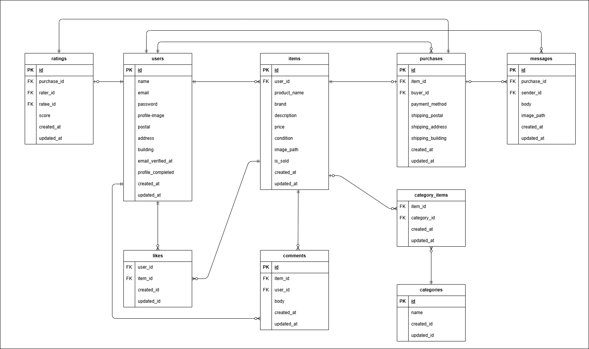

# COACHTECHフリマ

商品の出品と購入を行うことができるフリーマーケットWebアプリケーションです。

## 概要

- アプリ概要
  - このアプリはユーザー同士が商品を出品・購入できるフリマアプリです。
  - 会員登録したユーザーは商品出品・購入・取引チャット・評価機能を利用できます。
  - 会員以外のユーザーは商品一覧と商品詳細を閲覧することはできますが、ほかの機能は使えません。


## 主な機能
  - ユーザー登録・ログイン（メール認証付き）
  - プロフィール編集（名前、アイコン画像選択）
  - 商品出品（タイトル、ブランド、商品カテゴリ、価格、商品説明、画像アップロード、商品コンディション）
  - 商品一覧表示・商品詳細表示（いいね数とコメント数の確認も可能）
  - お気に入り登録/解除
  - コメント登録
  - 商品購入（コンビニ払い/ Stripeによるカード支払いを選択可能）
  - 配送先住所の変更
  - マイページから出品商品・購入商品・取引中商品の一覧を確認することができる。
  - 取引チャット機能
  - 取引中商品が複数ある場合はチャット画面のサイドバーから各チャット画面へ遷移可能
  - 未読メッセージ数の表示（マイページタブ/取引一覧）
  - マイページでの平均評価表示（★表示）
  - 取引にかかる相互の評価機能
  - 取引終了時のメール自動送信
  > ※本アプリではメール認証機能確認のため、MailHogを使用しています。  
  > ※チャット入力内容の保持（本文のみ）は、取引中商品が複数あり、チャット画面のサイドバーから遷移したときのみ対応しています。（JavaScript未使用）
## 環境構築

### Dockerビルド
1. リポジトリをクローン  
コマンドライン上
```bash
git clone git@github.com:kumumuma05/free-market.git
cd free-market
```
2. コンテナの起動  
コマンドライン上
```bash
docker-compose up -d --build
```

### Laravel 環境構築
1. PHPコンテナへ入る  
コマンドライン上
```bash
docker-compose exec php bash
```
2. パッケージのインストール  
PHPコンテナ上
```bash
composer install
```
3. 環境ファイル作成  
PHPコンテナ上
```bash
cp .env.example .env
```
4. Stripe（カード決済）設置（※カード決済を使用する場合のみ）  
 本アプリのカード決済機能はStripeを利用しています。  
 カード決済機能を利用する場合は、Stripeのテスト用APIキーを取得し、.envに設定してください。  
.envファイル内
```
STRIPE_KEY= （Stripeのpublishable key）
STRIPE_SECRET=（Stripe の Secret key）
```

5. アプリキー作成  
PHPコンテナ上
```bash
php artisan key:generate
```
6. マイグレーション実行（初期データも同時投入）  
PHPコンテナ上
```bash
php artisan migrate --seed
```
7. Storage のリンク作成  
 画像のアップロード機能を使用するために、Storageディレクトリへのリンクを作成します。  
- 通常のリンク作成  
 PHPコンテナ上
 ```bash
 php artisan storage:link
 ```
- Windows + Docker + WSL 環境で VSCode がリンクを認識しない場合  
 public/storage が VSCode 上で正しく表示されないことがあります。  
 その場合のみ以下の方法でリンクを再作成してください。  
 PHPコンテナ上
```bash
rm public/storage
ln -s ../storage/app/public public/storage
```

> ※ 使用しているOSによってはファイル権限が原因でエラーが発生する場合があります。  
>その際は環境に合わせて権限を調整してください。  

## ダミーデータについて  
- ダミー商品10件をSeederで投入しています。  
- ユーザー1:商品1～5の出品者  
- ユーザー2:商品6～10の出品者  
- ユーザー3:出品なし

## ログイン情報
- 本アプリではレビュー用にseederで登録されたユーザーが3名分存在しています。  
（開発環境での動作確認用であり、実際の利用時はユーザー自身が登録します）
  - ユーザー1  
   メールアドレス:user1@test.com  
   パスワード:password
  - ユーザー2  
   メールアドレス:user2@test.com  
   パスワード:password
  - ユーザー3  
   メールアドレス:user3@test.com  
   パスワード:password  
- 本アプリではメール認証機能のレビュー用にMailHogを使用しているため、メール認証時は、同サイトへ遷移するよう設定されています。

## テスト実施要領
  本アプリではPHPUnitを用いたFeatureテストを用意しています。テストにはテスト専用のデータベースを使用しています。テスト実施手順は下記のとおりです。  
1. 準備（初回のみ）  
- MYSQL　コンテナに入る
```bash
docker-compose exec mysql bash
```
- MySQL にログイン（データベースの作成は権限の問題で管理者でログインする必要があります。）
```bash
mysql -u root -p
```
> ※パスワードはdocker-compose.ymlファイルに記載されているとおり「root」を入力する。
- テスト用データベースを作成
```sql
CREATE DATABASE demo_test;
```
- MYSQLコンテナから出る
- テスト用マイグレーション実行(初期データも同時投入)  
PHPコンテナ上
```bash
php artisan migrate --seed --env=testing
```
> ※ この作業はテスト用データベースを初期構築する初回のみ（テスト実行時はRefreshDatabaseにより毎回リセットされます）
2. テスト実施  
PHPコンテナ上
```bash
php artisan test
```

## 使用技術

- PHP 8.1-fpm  
- Laravel 8.83.29  
- MySQL 8.0.26  
- Nginx 1.21.1  
- Stripe API （カード決済）  

## ER図



## URL
| 機能 | URL |
|------|------|
| ユーザー登録 | http://localhost/register |
| トップページ | http://localhost |
| メール確認 | http://localhost:8025 |
| phpMyAdmin | http://localhost:8080 |
